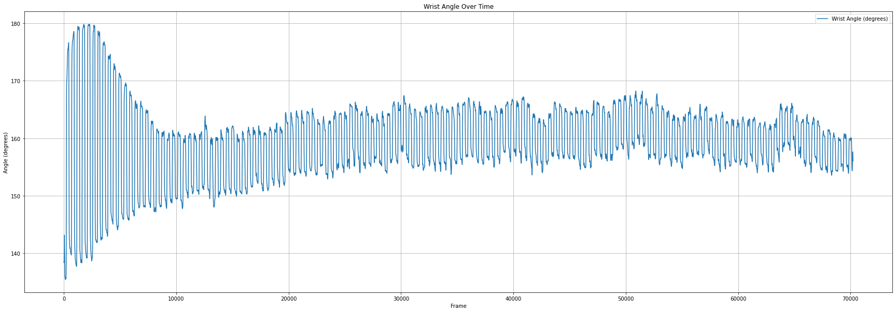
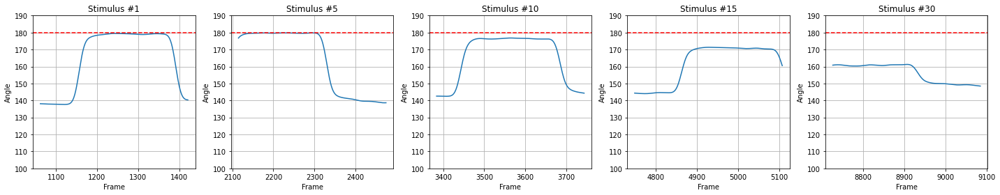
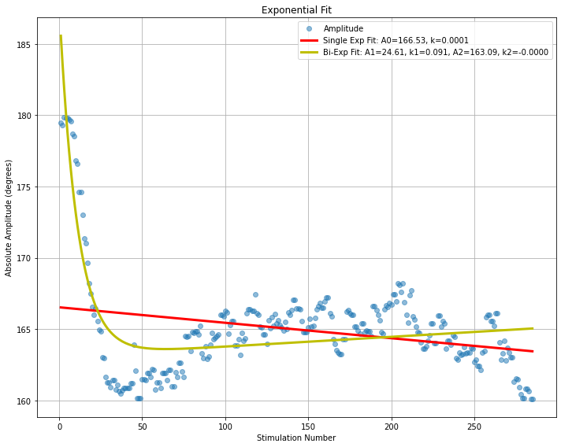

# Wrist Angle

This project uses the DeepLabCut GUI to label and predict wrist joint positions in videos, then analyzes the exported CSV files with a Jupyter Notebook (`angle.ipynb`).

## 📌 Project Overview

1. **Joint prediction with DeepLabCut GUI**
   - Load the project `Wrist_angle_DLC`.
   - Analyze new videos using the `shuffle 11` model (currently the best-performing).
   - Export the results as CSV files.
   - Check the likelihood values for MCP, wrist, and forearm keypoints (recommended: >0.6).

2. **Data analysis in Jupyter Notebook**
   - Load the exported CSV files.
   - Adjust the parameters (`distance`, `window`, and `remove_peaks`) to better segment each stimulation.
   - Visualize the processed data with plots.

## 📊 Results

